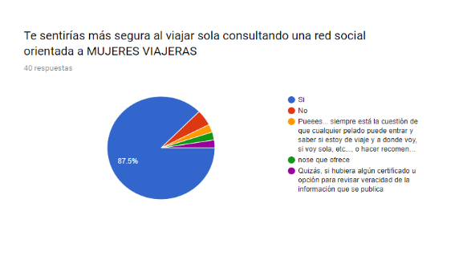
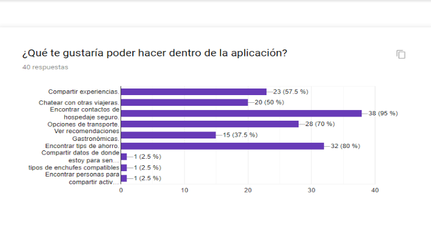
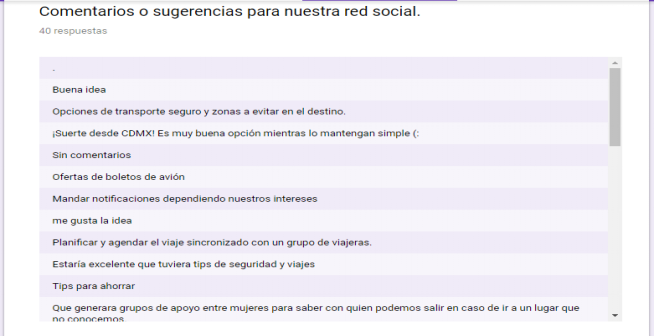
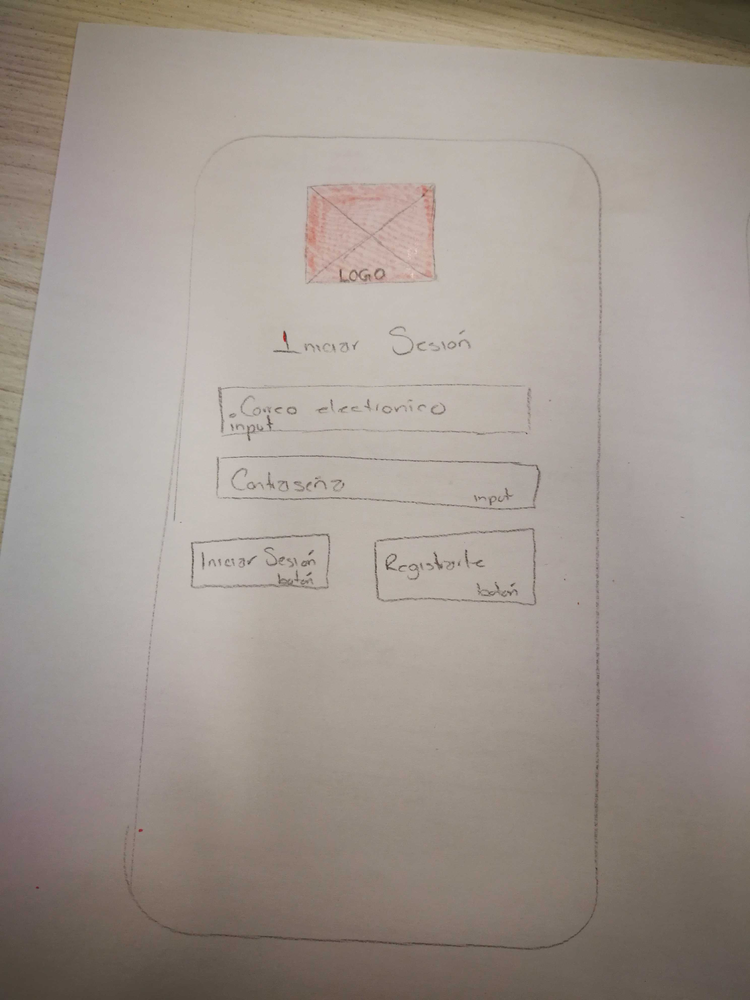
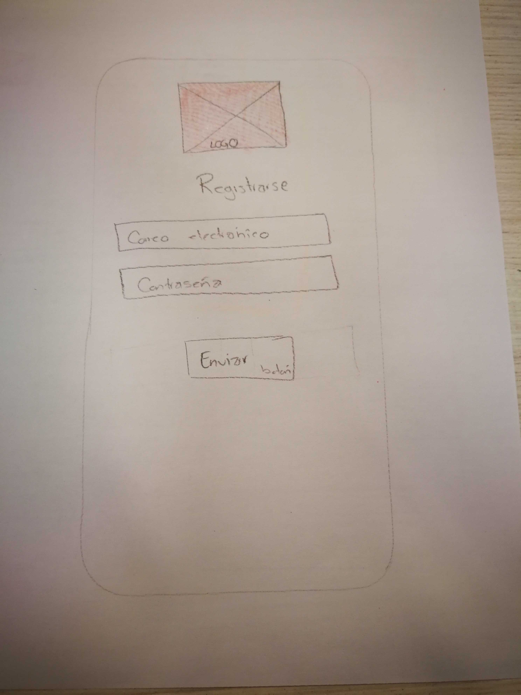
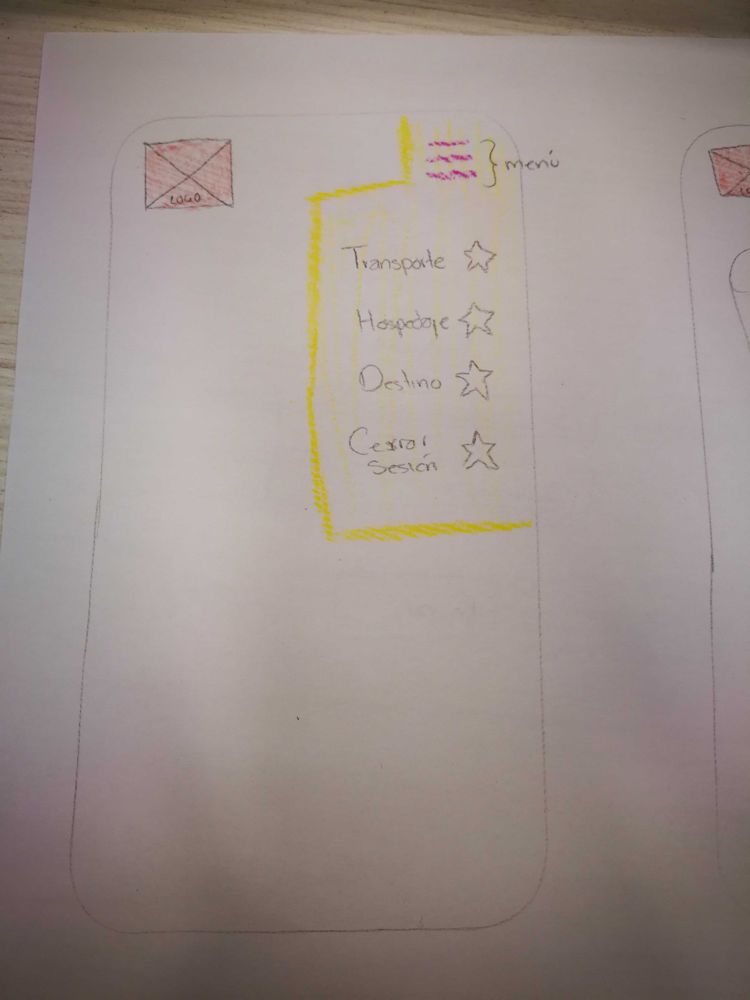
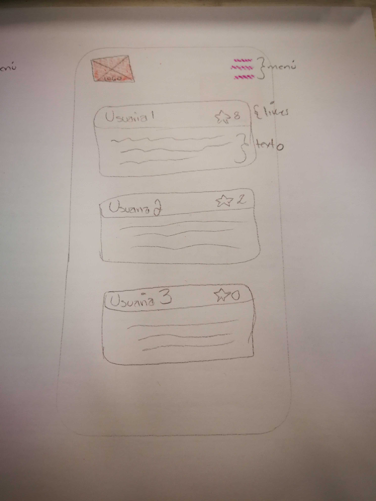

# Creando una Red Social

## Historia de Usuaria

Diana es una chica de 25 años a la que le gusta viajar sola o con su grupo de amigas. En su último viaje tuvo una mala experiencia en el hospedaje ya que por un portal de internet rento una cabaña costosa y al llegar a la dirección que le proporcionaron no existía dicha cabaña y decidió que a partir de entonces planificará con más cuidado sus próximos viajes.
Dentro de seis meses volverá a viajar y ahora en la planeación de su viaje se ha encontrado con mucha información, demasiado dispersa y además no se siente segura al apartar su hospedaje, y también tiene la incertidumbre de que transporte le sería más accesible en cuestiones de precios.
A Diana le gustaría contar con una aplicación donde pudiera encontrar información más precisa y tener acceso a experiencias de otras viajeras que le ayuden en la planificación, le den tips, y sobre todo acceso a contactos seguros de transporte y hospedaje.

## Elementos básicos de la red social Soy Viajera:
*Poner en contacto a mujeres viajeras de una manera práctica y sencilla.
*Permitir interacción entre todas los usuarias de la plataforma.
*Crear un posibilidad que los contactos online generen contactos reales.
*Permitir contacto ilimitado entre usuarias.
*Difusión viral de contenidos.

## Cómo descubriste las necesidades de los usuarios
Por medio de una encuesta en la cual se les preguntó sobre:
*¿Qué nombre para nuestra aplicación prefieres?
*¿Qué información necesitas al planificar un viaje?
*¿Te sentirás más segura, al viajar sola, consultando una red social, orientada a Mujeres Viajeras?
*¿Qué te gustaría poder hacer dentro de nuestra aplicación?

## Qué problema resuelve el producto para estos usuarios
*Resuelve la  problemática de la inseguridad de las mujeres al viajar solas   

## Objetivos de estos usuarios en relación con el producto
*Encontrar información precisa y en un solo lugar sobre las experiencias de otras viajeras que  ayuden a las usuarias a planificar un viaje seguro.
## Principales funcionalidades del producto y cuál es su prioridad:
*Compartir experiencias de viajes
*Crear comunidades de personas que viajan
*Recomendaciones por las mismas usuarias de transporte, hospedaje y gastronomía.

## Cómo verificaste que el producto les está resolviendo sus problemas
-Cuando las personas encuestadas respondieron la siguiente pregunta
*¿Te sentirás más segura, al viajar sola, consultando una red social, orientada a Mujeres Viajeras?
##Cómo te asegurarás que estos usuarios usen este producto
*Con publicidad en otras redes sociales como facebook.
*En comunidades de personas que les guste viajar.
*Por recomendación de las mismas usuarias.

### Prototipo Inicial de baja fidelidad:

En este diseño se muestran las primeras primeras propuestas para las pantallas, donde se muestran las acciones:

1.- Inicio de Sesión.

   Aqui podrán inciar sesión para poder ingresar a la página de inicio de Soy Viajera.

2.- Registrarse.

  En esta sección la usuaria podrá hacer su registro para ser parte de la app Soy Viajera.

  3.- Menú desplegable.

  En el menú desplegable encontraremos diferentes secciones, donde cada una de ellas nos lleva a su muro correspondiente. En cada muro se podrá hacer un post relacionado a la sección seleccionada.

### Prototipo Inicial de alta fidelidad:
Nuestro objetivo es llegar a este diseño y funcionalidad:
  [Open Soy Viajera Figma](https://www.figma.com/file/GpvcC5Cah4zus2vh5niMmPlt/Untitled?node-id=0%3A1)